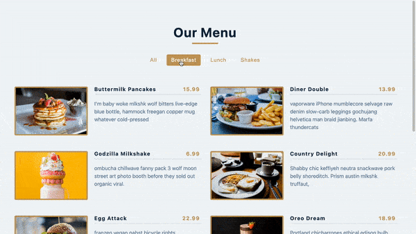

## Summary

While adding or removing a category in a menu list with filter buttons, the menu & filter buttons would automatically adjust.



## Note

[JavaScript: Remove Duplicates from an Array](https://wsvincent.com/javascript-remove-duplicates-array/)

## File structure

```
.
├── README.md
└── src
    ├── App.js
    ├── Categories.js
    ├── Menu.js
    ├── data.js
    ├── index.css
    └── index.js
```

## Available Scripts

In the project directory, you can run:

### `npm start`

Runs the app in the development mode.\
Open [http://localhost:3000](http://localhost:3000) to view it in your browser.
